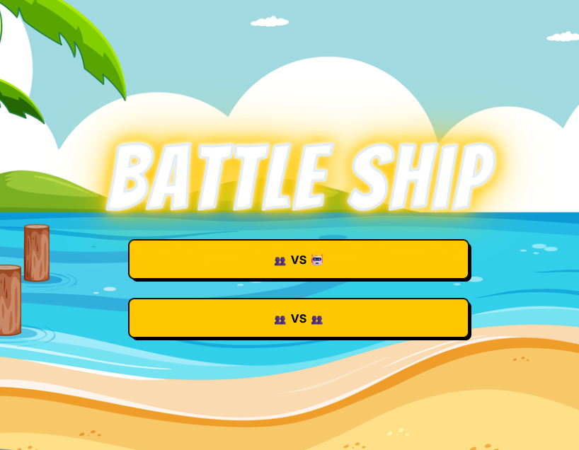
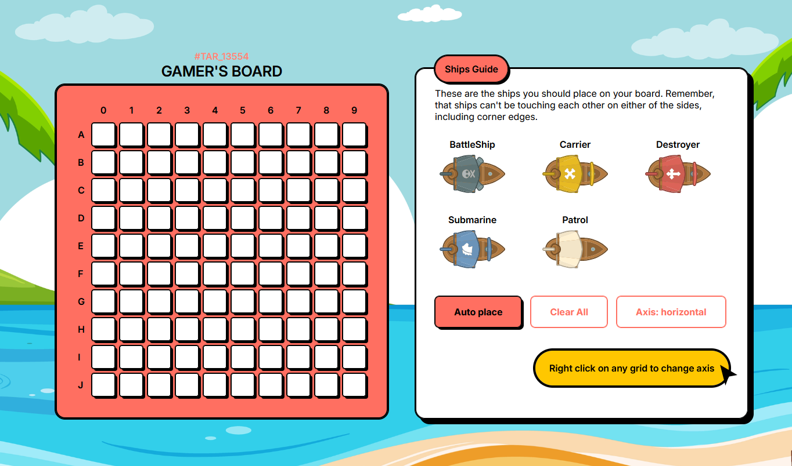
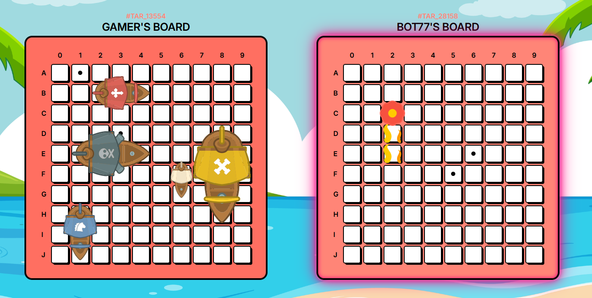
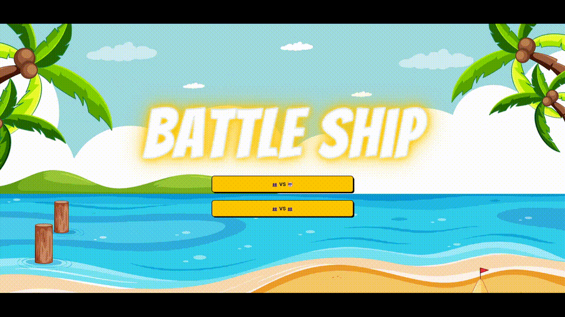
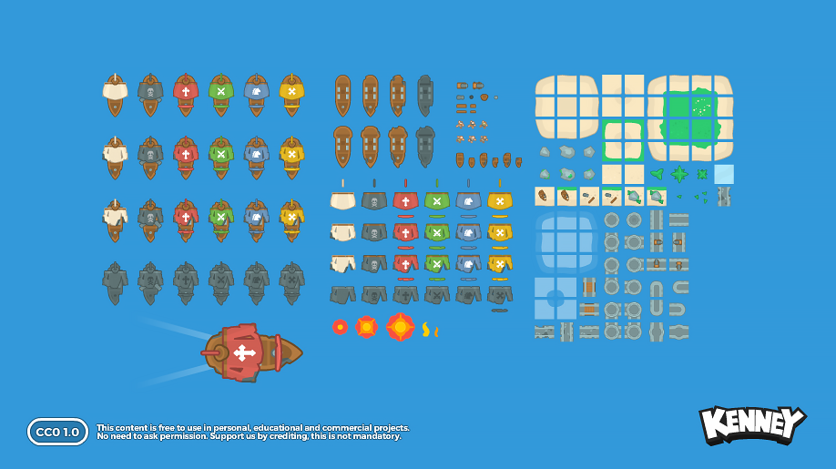

# Battle-ship-project-the-odin-project

<div align="center">

# 🏴‍☠️ Battleship

A browser-based Battleship game built with JavaScript.

### [☠️ Play the Game](https://dungnope.github.io/Battle-ship-project-the-odin-project/)

</div>

## 📸 Preview
 <br>
 <br>
 <br>

## 🎮 Features
 <br>


- 🎮 **Two Game Modes**
  - 🤖 **Player vs Computer** — Challenge an AI opponent in a turn-based battle.
  - 👥 **2-Player Local** — Two players take turns playing on separate boards on the same device.

- 🚢 **Ship Placement** — Place your ships before starting the battle.

- 🖐️/ 🖱️ **Drag drop / click** — Can place ship with click or drag/drop.

- ↕️↔️ **Rotate ship** — Click on a box of grid board to change direction or change in ship setup UI.

- 💥 **Hit & Miss Detection** — Track successful and unsuccessful attacks.

- 🎯 **Hit & Shoot Again** — Successfully hitting an enemy ship allows you to take another shot until missing shot.

- 🏆 **Win / Lose System** — Automatically determine the winner when all enemy ships are destroyed.

## 🛠️ Built With

- HTML5
- CSS3
- JavaScript (ES6+)
- Webpack
- Jest
- Git & GitHub Pages

## 🧠 What I Learned

This project helped me practice:

- Object-oriented programming with JavaScript (use class)
- ES6 modules
- DOM manipulation
- Event-driven programming
- Asynchronous JavaScript (for audio and image)
- Promises and `async/await` (change turn when end and audio and image sequence)
- Unit testing with Jest
- Separating game logic from UI logic
- Managing game state (not too much details)
- Webpack module bundling
- Deploying a web application with GitHub Pages

## ⚓ How to Play

1. Place your ships on the board.
2. Select a cell on the enemy board to attack.
3. A successful hit is marked on the board.
4. Continue attacking until all enemy ships are destroyed.
5. Sink all enemy ships to win the game.

```md
## 📁 Project Structure

src/
├── assets/              # Game assets such as images and sounds
│
├── models/              # Core game logic
│   ├── gameboard.js     # Handles board state, ship placement and attacks
│   ├── player.js        # Represents players and their game actions
│   └── ship.js          # Defines ship properties and behavior
│
├── UI_components/       # User interface and visual interaction
│   ├── animation.js     # Handles game animations
│   ├── assets.js        # Manages UI/game assets
│   ├── board.js         # Renders and updates game boards
│   └── gameplay.js      # Handles gameplay UI and user interaction both menu and play game phase
│
├── index.js             # Application entry point
├── miscellaneous.js     # Shared utility functions / adjacent fire slot for bot
├── style.css            # Application styling
└── template.html        # Main HTML template with webpack
```

## 🚀 Getting Started

### Prerequisites

Make sure you have the following installed:

- [Node.js](https://nodejs.org/)
- npm (included with Node.js)

### Installation

1. Clone the repository:

```bash
git clone https://github.com/Dungnope/Battle-ship-project-the-odin-project.git
```

2. Navigate to the project directory:

```bash
cd Battle-ship-project-the-odin-project
```

3. Install the dependencies:

```bash
npm install
```

### Development

Run the development server:

```bash
npm run dev
```

The index.html file will be generated in the `dist/` directory with development mode, you can download webpack server and change script in `package.json` for more convenient, I used Live Server Extension instead.

### Production

Create an optimized production build:

```bash
npm run build
```

The production files will be generated in the `dist/` directory with production mode.

## 🎨 Assets & Credits

### 🏴‍☠️ Pirate Pack



The ship and pirate-themed game assets used in this project are from **Kenney's Pirate Pack**.

- **Creator:** Kenney
- **Asset Pack:** [Pirate Pack](https://kenney.nl/assets/pirate-pack)
- **License:** [Creative Commons CC0](https://creativecommons.org/publicdomain/zero/1.0/)
- **Attribution:** Not required, but appreciated

Special thanks to **Kenney** for providing high-quality game assets for this project.

> All game assets remain under their respective licenses. The game's source code is separate from the third-party assets.

### 🎵 Music & Sound Effects

Music and sound effects used in this project are sourced from **Pixabay**.

- **Source:** [Pixabay Music](https://pixabay.com/music/)
- **License:** Pixabay Content License
- **Attribution:** Not required, but appreciated

> All third-party assets are used according to their respective licenses.

## 📚 Acknowledgements

This project was built as part of **[The Odin Project](https://www.theodinproject.com/lessons/node-path-javascript-battleship#project-solution)** JavaScript curriculum.

The project was created to practice JavaScript concepts including object-oriented programming, DOM manipulation, modular code, and unit testing.

Special thanks to **The Odin Project** for providing the curriculum and project guidelines.

## 📄 License

The source code of this project is licensed under the MIT License.

Third-party assets are subject to their respective licenses:

- **Graphics:** Kenney's Pirate Pack — CC0 1.0 Universal
- **Music & Sound Effects:** Pixabay Content License

See the [LICENSE](./LICENSE) file for the full license text.
